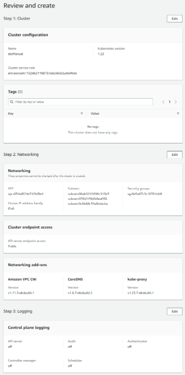

pulumi stack output kubeconfig --show-secrets > kubeconfig.yaml
set KUBECONFIG=%cd%\kubeconfig
kubectl version
kubectl cluster-info
kubectl get nodes

https://ap-south-1.console.aws.amazon.com/ec2/v2/home?region=ap-south-1#Instances:
https://ap-south-1.console.aws.amazon.com/ec2/v2/home?region=ap-south-1#SecurityGroups:

https://www.pulumi.com/registry/packages/aws/installation-configuration/
aws configure

aws eks describe-cluster --cluster-name <cluster-name>  --query cluster.endpoint
kubectl edit -n kube-system configmap/aws-auth
curl -o aws-iam-authenticator.exe https://s3.us-west-2.amazonaws.com/amazon-eks/1.21.2/2021-07-05/bin/windows/amd64/aws-iam-authenticator.exe
https://docs.aws.amazon.com/eks/latest/userguide/create-cluster.html

arn:aws:iam::132462119873:role/eksClusterRole

Diagnostics:
eks:index:VpcCni (my-cluster-vpc-cni):
error: Command failed: kubectl apply -f C:\Users\RAJANA~1\AppData\Local\Temp\tmp-8884gLK30EtgQ6Dh.tmp
Kubeconfig user entry is using deprecated API version client.authentication.k8s.io/v1alpha1. Run 'aws eks update-kubeconfig' to update.
Warning: spec.template.spec.affinity.nodeAffinity.requiredDuringSchedulingIgnoredDuringExecution.nodeSelectorTerms[0].matchExpressions[0].key: beta.kubernetes.io/os is deprecated since v1.14; use "kubernetes.io/os" instead
Warning: spec.template.spec.affinity.nodeAffinity.requiredDuringSchedulingIgnoredDuringExecution.nodeSelectorTerms[0].matchExpressions[1].key: beta.kubernetes.io/arch is deprecated since v1.14; use "kubernetes.io/arch" instead
error: unable to recognize "C:\\Users\\RAJANA~1\\AppData\\Local\\Temp\\tmp-8884gLK30EtgQ6Dh.tmp": no matches for kind "CustomResourceDefinition" in version "apiextensions.k8s.io/v1beta1"

kubernetes:core/v1:ConfigMap (my-cluster-nodeAccess):
error: failed to initialize discovery client: exec plugin: invalid apiVersion "client.authentication.k8s.io/v1alpha1"

pulumi:pulumi:Stack (eks-dev):
warning: aws:ec2/getSubnetIds:getSubnetIds verification warning: The aws_subnet_ids data source has been deprecated and will be removed in a future version. Use the aws_subnets data source instead.

    Kubeconfig user entry is using deprecated API version client.authentication.k8s.io/v1alpha1. Run 'aws eks update-kubeconfig' to update.
    Warning: spec.template.spec.affinity.nodeAffinity.requiredDuringSchedulingIgnoredDuringExecution.nodeSelectorTerms[0].matchExpressions[0].key: beta.kubernetes.io/os is deprecated since v1.14; use "kubernetes.io/os" instead
    Warning: spec.template.spec.affinity.nodeAffinity.requiredDuringSchedulingIgnoredDuringExecution.nodeSelectorTerms[0].matchExpressions[1].key: beta.kubernetes.io/arch is deprecated since v1.14; use "kubernetes.io/arch" instead
    error: unable to recognize "C:\\Users\\RAJANA~1\\AppData\\Local\\Temp\\tmp-8884gLK30EtgQ6Dh.tmp": no matches for kind "CustomResourceDefinition" in version "apiextensions.k8s.io/v1beta1"

Resources:
+ 18 created

Duration: 9m31s