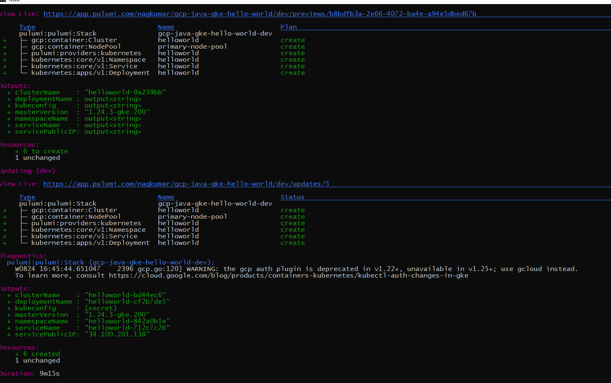
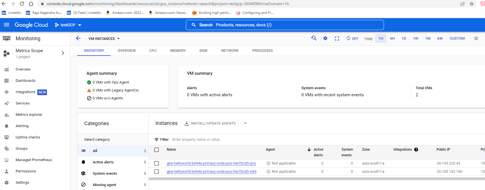
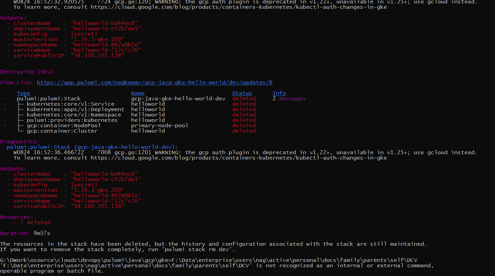

# Google Kubernetes Engine (GKE) Cluster

This example deploys an Google Cloud Platform (GCP) [Google Kubernetes Engine (GKE)](https://cloud.google.com/kubernetes-engine/) cluster, and deploys a Kubernetes Namespace and Deployment of NGINX

## Deploying the App

To deploy your infrastructure, follow the below steps.

### Prerequisites

1. [Install Pulumi](https://www.pulumi.com/docs/get-started/install/)
1. [Install Google Cloud SDK (`gcloud`)](https://cloud.google.com/sdk/docs/downloads-interactive)
1. Configure GCP Auth

    * Login using `gcloud`

        ```bash
        $ gcloud auth login
        $ gcloud config set project <YOUR_GCP_PROJECT_HERE>
        $ gcloud auth application-default login
        ```
   > Note: This auth mechanism is meant for inner loop developer
   > workflows. If you want to run this example in an unattended service
   > account setting, such as in CI/CD, please [follow instructions to
   > configure your service account](https://www.pulumi.com/docs/intro/cloud-providers/gcp/setup/). The
   > service account must have the role `Kubernetes Engine Admin` / `container.admin`.

### Steps

After cloning this repo, from this working directory, run these commands:

1. Create a new Pulumi stack, which is an isolated deployment target for this example:

   This will initialize the Pulumi stack.

    ```bash
    $ pulumi stack init
    ```

1. Set the required GCP configuration variables:

   This sets configuration options and default values for our cluster.

    ```bash
    $ pulumi config set gcp:project <YOUR_GCP_PROJECT_HERE>
    $ pulumi config set gcp:zone asia-south1-a     # any valid GCP Zone here
    ```

1. Stand up the GKE cluster:

   To preview and deploy changes, run `pulumi update` and select "yes."

   The `update` sub-command shows a preview of the resources that will be created
   and prompts on whether to proceed with the deployment. Note that the stack
   itself is counted as a resource, though it does not correspond
   to a physical cloud resource.

   You can also run `pulumi up --diff` to see and inspect the diffs of the
   overall changes expected to take place.

   Running `pulumi up` will deploy the GKE cluster. Note, provisioning a
   new GKE cluster takes ~10 minutes.

    ```bash
    $ pulumi up --yes
        Previewing update (demo)
        
        View Live: https://app.pulumi.com/***/gcp-java-gke-hello-world/demo/previews/2d73ed89-a034-4d78-8e63-806fdc81a25b
        
             Type                              Name                           Plan       Info
         +   pulumi:pulumi:Stack               gcp-java-gke-hello-world-demo  create     6 messages
         +   ├─ gcp:container:Cluster          helloworld                     create     
         +   ├─ gcp:container:NodePool         primary-node-pool              create     
         +   ├─ pulumi:providers:kubernetes    helloworld                     create     
         +   ├─ kubernetes:core/v1:Namespace   helloworld                     create     
         +   ├─ kubernetes:apps/v1:Deployment  helloworld                     create     
         +   └─ kubernetes:core/v1:Service     helloworld                     create     
         
        Diagnostics:
          pulumi:pulumi:Stack (gcp-java-gke-hello-world-demo):
            > Task :app:compileJava UP-TO-DATE
            > Task :app:processResources NO-SOURCE
            > Task :app:classes UP-TO-DATE
            > Task :app:run
            BUILD SUCCESSFUL in 2s
            2 actionable tasks: 1 executed, 1 up-to-date
         
        
        Updating (demo)
        
        View Live: https://app.pulumi.com/***/gcp-java-gke-hello-world/demo/updates/1
        
             Type                              Name                           Status      Info
         +   pulumi:pulumi:Stack               gcp-java-gke-hello-world-demo  created     30 messages
         +   ├─ gcp:container:Cluster          helloworld                     created     
         +   ├─ gcp:container:NodePool         primary-node-pool              created     
         +   ├─ pulumi:providers:kubernetes    helloworld                     created     
         +   ├─ kubernetes:core/v1:Namespace   helloworld                     created     
         +   ├─ kubernetes:apps/v1:Deployment  helloworld                     created     
         +   └─ kubernetes:core/v1:Service     helloworld                     created     
         
        Diagnostics:
          pulumi:pulumi:Stack (gcp-java-gke-hello-world-demo):
            > Task :app:compileJava UP-TO-DATE
            > Task :app:processResources NO-SOURCE
            > Task :app:classes UP-TO-DATE
            > Task :app:run
            BUILD SUCCESSFUL in 11m 17s
            2 actionable tasks: 1 executed, 1 up-to-date
         
        Outputs:
            clusterName    : "helloworld-10e2053"
            deploymentName : "helloworld-krnibosh"
            kubeconfig     : "[secret]"
            masterVersion  : "1.22.6-gke.300"
            namespaceName  : "helloworld-p2a10vq4"
            serviceName    : "helloworld-h7jipvp8"
            servicePublicIP: "***"
            urn            : "urn:pulumi:demo::gcp-java-gke-hello-world::pulumi:pulumi:Stack::gcp-java-gke-hello-world-demo"
        
        Resources:
            + 7 created
        
        Duration: 11m18s
    ```

1. After ~10 minutes, your cluster will be ready, and the kubeconfig JSON you'll use to connect to the cluster will
   be available as an output.

   As part of the update, you'll see some new objects in the output: a
   `Namespace` in Kubernetes to deploy into, a `Deployment` resource for
   the NGINX app, and a LoadBalancer `Service` to publicly access NGINX.

   Pulumi understands which changes to a given cloud resource can be made
   in-place, and which require replacement, and computes
   the minimally disruptive change to achieve the desired state.

   > **Note:** Pulumi auto-generates a suffix for all objects.
   > See the [Pulumi Programming Model](https://www.pulumi.com/docs/intro/concepts/resources/#autonaming) for more info.
   >
   > ```
   > clusterName    : "helloworld-10e2053"
   > deploymentName : "helloworld-krnibosh"
   > kubeconfig     : "[secret]"
   > masterVersion  : "1.22.6-gke.300"
   > namespaceName  : "helloworld-p2a10vq4"
   > serviceName    : "helloworld-h7jipvp8"
   > servicePublicIP: "***"
   > urn            : "urn:pulumi:demo::gcp-java-gke-hello-world::pulumi:pulumi:Stack::gcp-java-gke-hello-world-demo"
   > ```

   If you visit the FQDN listed in `servicePublicIP` you should land on the
   NGINX welcome page. Note, that it may take a minute or so for the
   LoadBalancer to become active on GCP.

1. Access the Kubernetes Cluster using `kubectl`

   To access your new Kubernetes cluster using `kubectl`, we need to setup the
   `kubeconfig` file and download `kubectl`. We can leverage the Pulumi
   stack output in the CLI, as Pulumi facilitates exporting these objects for us.

    ```bash
    $ pulumi stack output kubeconfig --show-secrets > kubeconfig
    $ export KUBECONFIG=$PWD/kubeconfig
    $ export KUBERNETES_VERSION=1.11.6 && sudo curl -s -o /usr/local/bin/kubectl https://storage.googleapis.com/kubernetes-release/release/v${KUBERNETES_VERSION}/bin/linux/amd64/kubectl && sudo chmod +x /usr/local/bin/kubectl

    $ kubectl version
    $ kubectl cluster-info
    $ kubectl get nodes
    ```

   We can also use the stack output to query the cluster for our newly created Deployment:

    ```bash
    $ kubectl get deployment $(pulumi stack output deploymentName) --namespace=$(pulumi stack output namespaceName)
    $ kubectl get service $(pulumi stack output serviceName) --namespace=$(pulumi stack output namespaceName)
    ```

   We can also create another NGINX Deployment into the `default` namespace using
   `kubectl` natively:

    ```bash
    $ kubectl create deployment my-nginx --image=nginx
    $ kubectl get pods
    $ kubectl delete deployment my-nginx
    ```

   Of course, by doing so, resources are outside of Pulumi's purview, but this simply
   demonstrates that all the `kubectl` commands you're used to will work.

1. Experimentation

   From here on, feel free to experiment. Simply making edits and running `pulumi up` afterwords, will incrementally update your stack.


1. Once you've finished experimenting, tear down your stack's resources by destroying and removing it:

    ```bash
    $ pulumi destroy --yes
    $ pulumi stack rm --yes
    ```


    pulumi:pulumi:Stack       gcp-java-gke-hello-world-dev  **failed**
+   └─ gcp:container:Cluster  helloworld                    **creating fai


error as billing is not configured properly

Diagnostics:
pulumi:pulumi:Stack (gcp-java-gke-hello-world-dev):
error: update failed

gcp:container:Cluster (helloworld):
error: 1 error occurred:
* googleapi: Error 400: Failed precondition when calling the ServiceConsumerManager: tenantmanager::185014: Consumer 651165881348 should enable service:container.googleapis.com before generating a service account.
com.google.api.tenant.error.TenantManagerException: Consumer 651165881348 should enable service:container.googleapis.com before generating a service account., failedPrecondition

Resources:
1 unchanged



https://console.cloud.google.com/monitoring/dashboards/resourceList/gce_instance?referrer=search&project=testgcp-360409&timeDomain=1h
